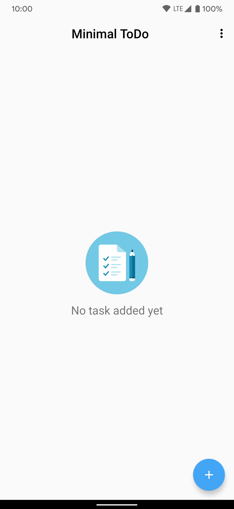
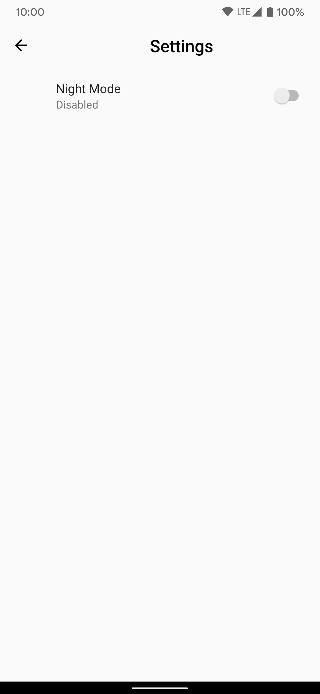
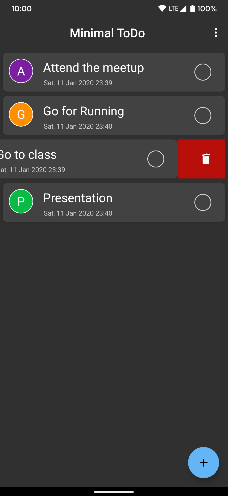
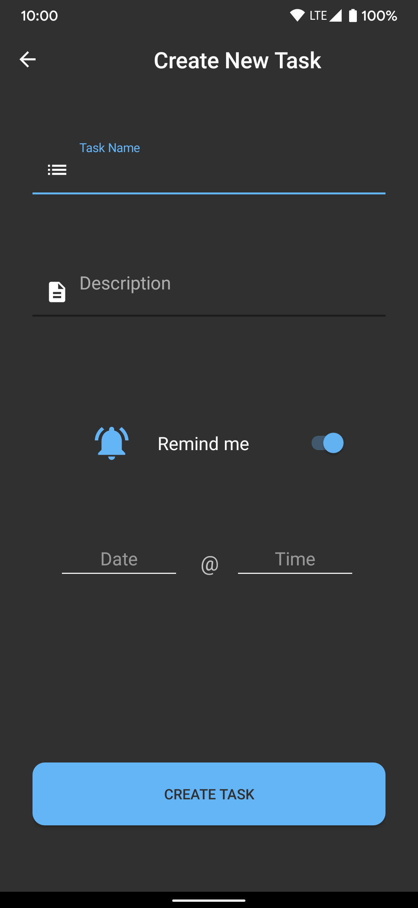

# Minimal ToDo

### A fully Material ToDo app with minimal features, just enough to be useful.
#### It can be used as reminder for the daily tasks or to just store your daily tasks which are to be performed in a day

### Screenshots
<table>
        <tr>
<td></td>
<td></td>
<td></td>
        </tr>
    <tr>
<td></td>
<td></td>
<td></td>
        </tr>
</table>     

